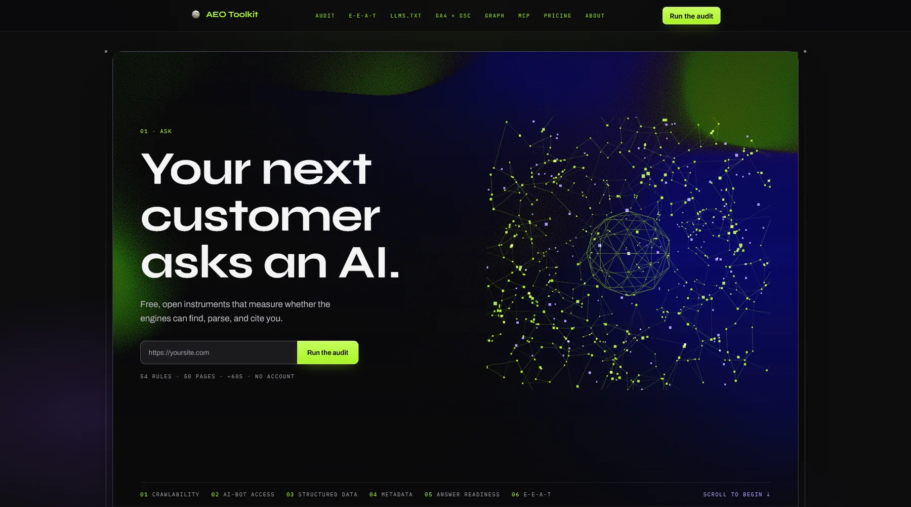
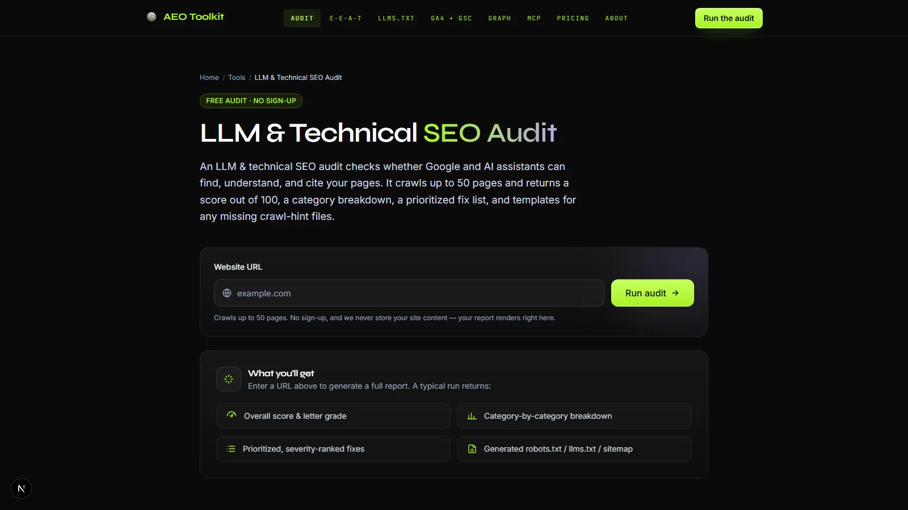

<div align="center">

<picture>
  <source media="(prefers-color-scheme: dark)" srcset="brand/logo-dark.png">
  
</picture>

# AEO Toolkit — AI Search Optimization Suite

### Rank in ChatGPT, Claude, Perplexity &amp; AI Overviews

[](https://typescriptlang.org)
[](LICENSE)
[](https://advancelabs.dev)
[](brand/README.md)

</div>

> Open-source TypeScript monorepo for **Answer Engine Optimization (AEO)**, Generative Engine Optimization (GEO), and AI citation visibility. Contributions welcome — see [CONTRIBUTING.md](CONTRIBUTING.md).

**Try it without installing anything:** the five tools run free in the browser at
**[advancelabs.dev/tools](https://advancelabs.dev/tools)** — no sign-up, no account.
Point the auditor at a URL and it returns a weighted, per-rule report in about a minute.

<a href="https://advancelabs.dev/tools"></a>

Those five are the browser tools. The full suite is **ten**: these five, plus three
MCP servers (`ai-visibility`, `backlink`, `ga-gsc`) exposing 22 tools to Claude or any MCP
client, plus a scheduled content agent ([`@advance-labs/blogging`](packages/blogging)) and the
[Chrome extension](apps/chrome-extension). See [`docs/reference/tools.md`](docs/reference/tools.md)
for the full map.

---

## What is AEO?

**Answer Engine Optimization (AEO)** is the practice of structuring your content so that AI assistants — ChatGPT, Perplexity, Claude, Gemini — cite your site when answering questions in your domain. Traditional SEO gets you ranked on the blue-link results page. AEO gets you *quoted* in the AI answer.

As AI-powered search becomes the default discovery layer, AEO is the new SEO.

---

## The audit

54 rules across crawlability, AI-bot access, structured data, metadata, answer readiness and
E-E-A-T, run against up to 50 pages, scored out of 100, with a prioritised fix list and templates
for any crawl-hint file you're missing. Free, no account, and your data stays yours.



---

## Packages

| Package | Description |
|---------|-------------|
| [`@advance-labs/crawler`](packages/crawler) | Multi-threaded web crawler with robots.txt compliance, sitemap parsing, and per-host rate limiting |
| [`@advance-labs/html-parser`](packages/html-parser) | Extracts meta tags, Open Graph, Twitter Cards, headings, images, links, and JSON-LD from HTML |
| [`@advance-labs/schema-validator`](packages/schema-validator) | Validates Schema.org JSON-LD structured data against known types |
| [`@advance-labs/scoring`](packages/scoring) | Scores pages on 54 technical SEO, AEO, and E-E-A-T rules — returns a numeric score with per-rule explanations |
| [`@advance-labs/google-api`](packages/google-api) | Google Search Console + GA4 client — list properties, fetch impressions, submit sitemaps |
| [`@advance-labs/storage`](packages/storage) | Supabase token store with AES-256-GCM encryption, in-memory and Upstash rate limiters |
| [`@advance-labs/mcp-core`](packages/mcp-core) | MCP (Model Context Protocol) transport helpers for exposing AEO tools to AI agents |
| [`@advance-labs/ui`](packages/ui) | React components for rendering AEO audit results — score rings, rule lists, diff views |
| [`@advance-labs/backlinks`](packages/backlinks) | Backlink graph building and link analysis |
| [`@advance-labs/llm`](packages/llm) | Provider-agnostic LLM client used by the content audits |
| [`@advance-labs/pdf`](packages/pdf) | Renders audit reports to PDF |

Plus `blogging`, `net-guard`, `orchestrator`, `types` and `config`. Applications live in
[`apps/console`](apps/console) (the Next.js app behind the hosted tools) and
[`apps/chrome-extension`](apps/chrome-extension).

---

## Quick Start

Six packages are published to npm and usable on their own:

```bash
npm i @advance-labs/scoring      # the 54-rule audit engine
npm i @advance-labs/net-guard    # SSRF-safe fetch: re-checks every redirect hop
npm i @advance-labs/crawler      # polite crawler with robots.txt + rate limiting
npm i @advance-labs/html-parser
npm i @advance-labs/schema-validator
npm i @advance-labs/types        # shared types, a dependency of the above
```

> The remaining packages stay workspace-internal (`private: true`) — they are glue for this
> repo rather than things worth supporting standalone. The hosted tools at
> [advancelabs.dev/tools](https://advancelabs.dev/tools) need no install at all.

```bash
git clone https://github.com/Advance-Labs/aeo-toolkit.git
cd aeo-toolkit
pnpm install
pnpm build          # turbo builds every package
pnpm test           # the full suite, no network
pnpm dev --filter=@advance-labs/console   # run the console locally
```

Or run the whole console in Docker with no accounts and no keys:

```bash
docker compose up --build   # then open http://localhost:3000
```

See [`docs/SELF-HOSTING.md`](docs/SELF-HOSTING.md) for the full self-hosting guide, or read the
full documentation at **[docs.advancelabs.dev/aeo-toolkit](https://docs.advancelabs.dev/aeo-toolkit)**.

Once built, the packages compose like this:

```ts
import { crawl } from '@advance-labs/crawler'
import { parseHtml } from '@advance-labs/html-parser'
import { scorePage } from '@advance-labs/scoring'

const pages = await crawl('https://example.com')
for (const page of pages) {
  const parsed = parseHtml(page.html)
  const score = scorePage(parsed)
  console.log(page.url, score.total, score.rules)
}
```

---

## Why AEO?

When a user asks ChatGPT "what is the best tool for X?", the answer comes from indexed content that AI models trust — not from ad-auction bidding. The trust signals for AI citation are:

- **Structured data** (JSON-LD `Organization`, `FAQPage`, `HowTo`)
- **`llms.txt`** — the AI equivalent of `robots.txt`
- **Canonical, server-rendered HTML** — AI crawlers prefer static content
- **Topical authority** — consistent, in-depth coverage of a topic

AEO Toolkit automates auditing all of these.

---

## Monorepo Structure

```
aeo-toolkit/
├── packages/          # 16 shared libraries (crawler, parser, scorer, etc.)
├── apps/console/      # Next.js app behind the hosted tools
├── apps/chrome-extension/
├── apps/docs/         # Astro + Starlight docs site (renders ../../docs)
├── docs/              # the documentation itself
└── brand/             # the mark, lockups, palette and type (brand/README.md)
```

Built with [Turborepo](https://turbo.build) · TypeScript 5 · Vitest · React 19

---

## Design

The console follows one visual system: a near-black ground, a single acid-green signal
colour, mono lab-sheet labels, Syne headlines, and the Advance Labs sphere as the mark. The
palette, type, tokens and rules are in [`brand/README.md`](brand/README.md), with the assets
beside it. Anything a user sees should follow it, and
[`docs/CONVENTIONS.md`](docs/CONVENTIONS.md#design-and-brand) says how in code.

---

## Made by Advance Labs

AEO Toolkit is built and maintained by **[Advance Labs Inc.](https://advancelabs.dev)** — a software studio building [Creatin](https://www.creatin.ca), [Cartrix](https://www.cartrix.live), and this toolkit.

This project dogfoods its own tooling: `advancelabs.dev` ships with `llms.txt`, JSON-LD Organization schema, SSG-rendered pages, and canonical URLs — all patterns the scoring engine teaches.

---

## Code of Conduct

We follow the [Contributor Covenant](https://www.contributor-covenant.org/version/2/1/code_of_conduct/) — be respectful and constructive in all project spaces, and report unacceptable behavior to [conduct@advancelabs.dev](mailto:conduct@advancelabs.dev).

---

<sub>© 2026 Advance Labs Inc. — <a href="https://advancelabs.dev">advancelabs.dev</a></sub>
